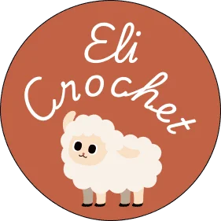
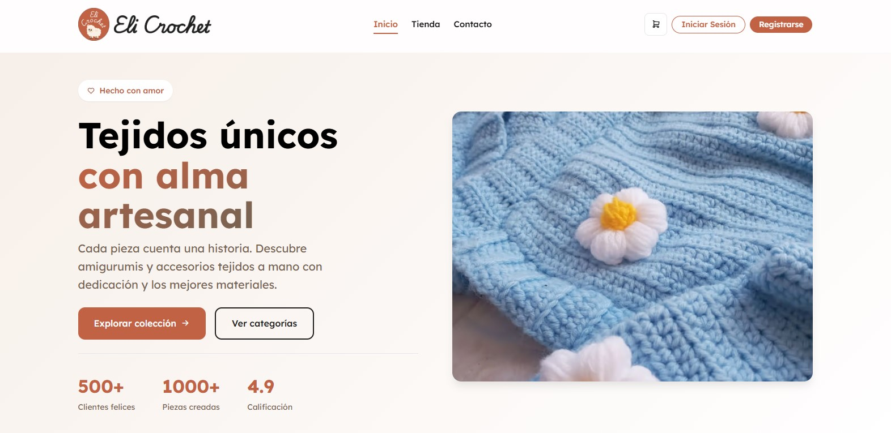
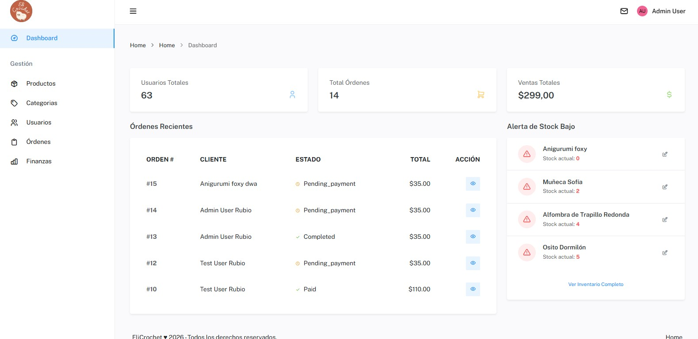

<p align="center">
  
</p>

<p align="center">
  <a href="https://github.com/LeandroRubio-73456/EliCrochet-Ecommerce/actions/workflows/ci.yml"></a>
  <a href="https://sonarcloud.io/summary/new_code?id=LeandroRubio-73456_elicrochet-ecommerce"></a>
  <a href="https://sonarcloud.io/summary/new_code?id=LeandroRubio-73456_elicrochet-ecommerce"></a>
</p>

# EliCrochet Ecommerce

<p align="left">
  
</p>

Este es un proyecto de comercio electrónico desarrollado con **Laravel**, diseñado para la venta y gestión de productos de crochet. El sistema incluye gestión de catálogo, carrito de compras, pedidos y un panel administrativo completo.

Este proyecto forma parte del trabajo final de la asignatura **Calidad de Software**, implementando estándares ISO/IEC 25010 y métricas de calidad SQuaRE.

## Galería

| Vista Cliente (Catálogo) | Vista Administración |
|:---:|:---:|
|  |  |

*(Nota: Las imágenes se encuentran en la carpeta `public/screenshots`)*

## Requisitos

Asegúrate de tener instalados los siguientes componentes en tu entorno de desarrollo:

- [PHP 8.2](https://www.php.net/) o superior
- [Composer](https://getcomposer.org/)
- [Node.js](https://nodejs.org/) y NPM
- Base de datos (MySQL/MariaDB)

## Instalación

Sigue estos pasos para configurar el proyecto en tu máquina local:

1.  **Clonar el repositorio**
    ```bash
    git clone https://github.com/LeandroRubio-73456/elicrochet-ecommerce.git
    cd elicrochet-ecommerce
    ```

2.  **Ejecutar el script de configuración**
    El proyecto incluye un comando personalizado que automatiza la instalación de dependencias, `.env`, key generation, migraciones y seeders.

    ```bash
    composer run setup
    ```

    > **Nota:** Este comando ejecuta internamente: `composer install`, copia del `.env`, `key:generate`, `migrate --force`, `db:seed` (datos de prueba), `npm install` y `npm run build`.

## Ejecución

Para iniciar el servidor de desarrollo y los procesos necesarios (vite, queue), utiliza el comando:

```bash
composer run dev

O si prefieres ejecutar solo el servidor de Laravel:

```bash
php artisan serve
```

## Credenciales de Acceso (Entorno Local)

Para fines de prueba y evaluación de la tesis, se han generado los siguientes usuarios mediante los Seeders:

| Rol | Usuario (Email) | Contraseña | Descripción |
|:---|:---|:---|:---|
| **Administrador** | `admin@elicrochet.com` | `password` | Acceso total al dashboard, gestión de productos y usuarios. |
| **Cliente** | `cliente@elicrochet.com` | `password` | Acceso a compra, carrito y gestión de perfil. |

## Tests y Calidad

Para ejecutar las pruebas automatizadas del proyecto (PHPUnit):

```bash
php artisan test
```

Este proyecto está integrado con **SonarCloud** para análisis estático de código, deuda técnica y cobertura.

---
**Desarrollado por:** Leandro Rubio
