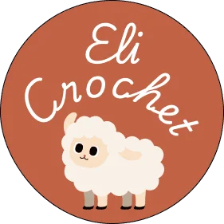
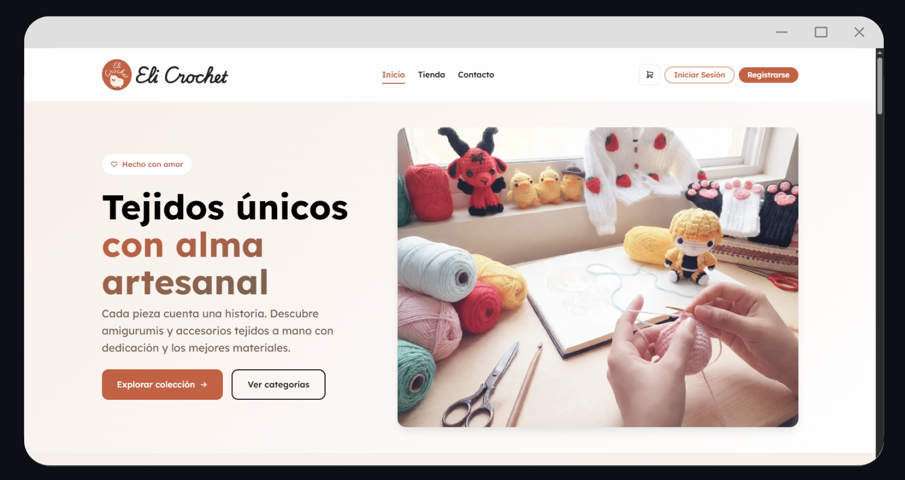
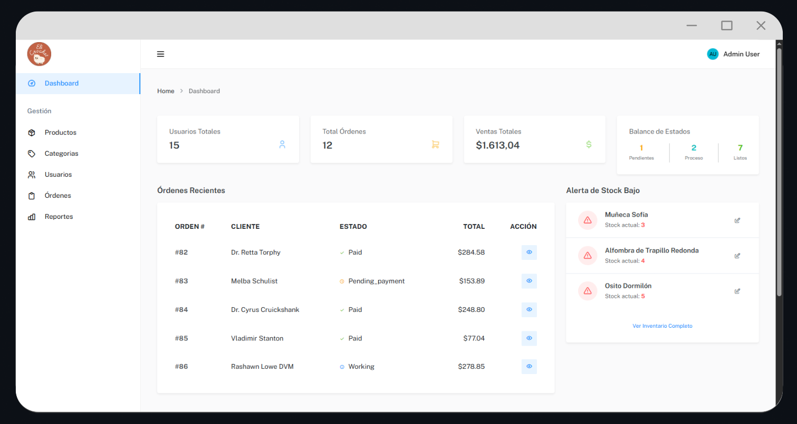

# EliCrochet Ecommerce

<p align="center">
  
</p>

Solución E-commerce desarrollada para EliCrochet, una microempresa de artesanías en Ecuador. Este sistema optimizó su gestión de inventario y permitió digitalizar sus ventas que antes eran manuales por WhatsApp.

## [Ver Demo en Vivo](https://elicrochet.shop)

<p align="center">
  <a href="https://github.com/LeandroRubio-73456/EliCrochet-Ecommerce/actions/workflows/ci.yml">
    
  </a>
  <a href="https://sonarcloud.io/summary/new_code?id=LeandroRubio-73456_elicrochet-ecommerce">
    
  </a>
  <a href="https://sonarcloud.io/summary/new_code?id=LeandroRubio-73456_elicrochet-ecommerce">
    
  </a>
  <a href="https://opensource.org/licenses/MIT">
    
  </a>
</p>

## Stack Tecnológico

<p align="center">
  
  
  
  
</p>

## Requisitos Previos

- **PHP 8.2+** (con extensiones estándar de Laravel habilitadas)
- **Composer 2.x**
- **Node.js 20.x**

> **Nota:** El proyecto está configurado por defecto para usar **SQLite**, por lo que no necesitas instalar MySQL ni crear bases de datos manualmente para probarlo.

## Instalación Rápida

1. **Clonar el repositorio:**
   ```bash
   git clone https://github.com/LeandroRubio-73456/elicrochet-ecommerce.git
   cd elicrochet-ecommerce
   ```

2. **Configurar automágicamente:**
   El proyecto incluye un script que instala dependencias, configura el entorno (.env), genera claves, base de datos y compila los assets.
   ```bash
   composer run setup
   ```

   *(Si prefieres usar MySQL/MariaDB: Copia el `.env.example` a `.env`, configura tus credenciales de BD y ejecuta `composer install && php artisan migrate --seed` manualmente).*

## Ejecución

Para iniciar el servidor local, los workers y Vite en un solo comando:

```bash
composer run dev
```

Accede a la aplicación en: [http://localhost:8000](http://localhost:8000)

## Credenciales de Prueba

El comando de setup genera automáticamente estos usuarios para que puedas probar todos los roles:

| Rol | Email | Contraseña |
| :--- | :--- | :--- |
| **Administrador** | `admin@elicrochet.com` | `password` |
| **Cliente** | `test@example.com` | `password` |

## Tests

El proyecto cuenta con una suite de pruebas automatizadas (>80% de cobertura) para garantizar la estabilidad.

```bash
# Ejecutar todos los tests
php artisan test
```

## Galería

<p align="center">
  
  
</p>

## Licencia

Este proyecto es software de código abierto bajo la licencia [MIT](https://opensource.org/licenses/MIT).
