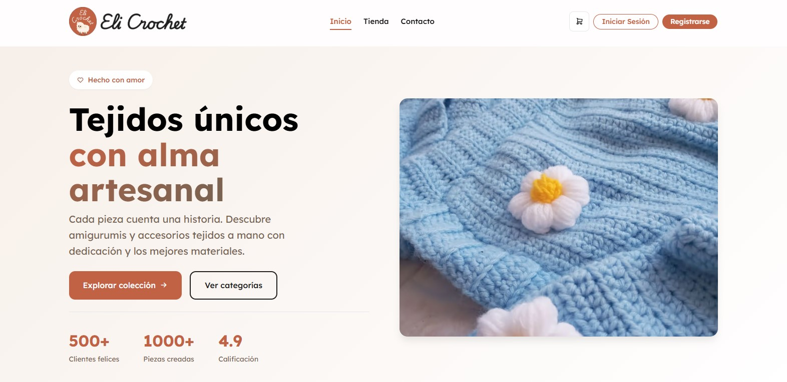
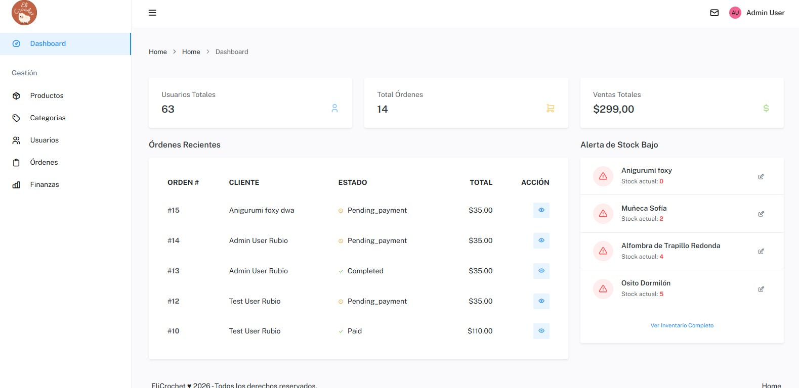

<p align="center">
  
</p>

<h1 align="center">EliCrochet Ecommerce</h1>

<p align="center">
  <strong>Plataforma de comercio electrónico especializada en productos artesanales de crochet</strong>
</p>

<p align="center">
  <a href="https://github.com/LeandroRubio-73456/EliCrochet-Ecommerce/actions/workflows/ci.yml">
    
  </a>
  <a href="https://sonarcloud.io/summary/new_code?id=LeandroRubio-73456_elicrochet-ecommerce">
    
  </a>
  <a href="https://sonarcloud.io/summary/new_code?id=LeandroRubio-73456_elicrochet-ecommerce">
    
  </a>
  <a href="https://opensource.org/licenses/MIT">
    
  </a>
</p>

---

## Tabla de Contenidos

- [Descripción](#-descripción)
- [Características Principales](#-características-principales)
- [Tecnologías](#-tecnologías)
- [Galería](#-galería)
- [Requisitos](#-requisitos)
- [Instalación](#-instalación)
- [Ejecución](#-ejecución)
- [Credenciales de Acceso](#-credenciales-de-acceso)
- [Tests y Calidad](#-tests-y-calidad)
- [Estructura del Proyecto](#-estructura-del-proyecto)
- [Licencia](#-licencia)
- [Contacto](#-contacto)

---

## Descripción

**EliCrochet Ecommerce** es una plataforma de comercio electrónico desarrollada con **Laravel 12**, especializada en la venta y gestión de productos artesanales de crochet. El sistema ofrece una experiencia robusta y segura, respaldada por un índice de **cobertura de pruebas superior al 80%**.

- Carrito de compras reactivo y seguro
- Pasarela de pagos integrada (**PayPhone**)
- Gestión avanzada de pedidos (Stock y Personalizados)
- Sistema dinámico de perfiles y direcciones (con soporte para cédula/ID)
- Panel administrativo con control de ventas
- Calidad de código certificada con **SonarCloud** y **Lighthouse CI**

---

## Características Principales

### Para Clientes
- Catálogo optimizado con filtros dinámicos y búsqueda.
- Carrito de compras con persistencia y validaciones de stock en tiempo real.
- **Pedidos Personalizados:** Formulario especializado para solicitudes a medida con carga de referencias.
- Gestión de perfil completa y libreta de direcciones detallada.
- Historial de pedidos con seguimiento de estados y reintentos de pago.
- Sistema de valoraciones y testimonios.

### Para Administradores (Back-office)
- **Panel de Control:** Resumen de ventas, gestión de inventario y alertas de stock bajo.
- Gestión de catálogo con carga múltiple de imágenes.
- Administración de usuarios con roles definidos.
- Sistema de estados de pedido (Pendiente, Pagado, Fabricando, Enviado, Completado).
- **Gestión de Ventas:** Visualización detallada de transacciones y exportación a Excel.
- Generación de etiquetas de envío.

---

## Tecnologías

### Backend & Core
- **Framework:** Laravel 12.x
- **PHP:** 8.2+
- **Base de Datos:** MySQL / SQLite (optimizado para testing en memoria)
- **Pagos:** PayPhone API Integration
- **Estándar:** PSR-12 / Laravel Pint

### Frontend
- **Styles:** CSS Moderno (Vanilla CSS) para la interfaz de cliente.
- **Admin Template:** Basado en Bootstrap 5 para el panel administrativo.
- **JavaScript:** Vanilla JS
- **Build Tool:** Vite 7.x
- **Icons:** Tabler Icons

### Calidad & Testing
- **PHPUnit:** +100 tests unitarios e integración (+80% coverage)
- **SonarCloud:** Análisis estático detallado y Quality Gate
- **GitHub Actions:** Pipeline de CI/CD automatizado
- **Lighthouse CI:** Monitorización continua de WPO, SEO y Accesibilidad

---

## Galería

| Vista Cliente | Vista Administración |
|:---:|:---:|
|  |  |

---

## Requisitos

Antes de comenzar, asegúrate de tener instalado:

| Software | Versión Mínima | Enlace |
|:---------|:---------------|:-------|
| PHP | 8.2 | [Descargar](https://www.php.net/) |
| Composer | 2.x | [Descargar](https://getcomposer.org/) |
| Node.js | 20.x | [Descargar](https://nodejs.org/) |
| MySQL | 8.0 | [Descargar](https://www.mysql.com/) |

### Extensiones PHP Requeridas
- BCMath, Ctype, cURL, DOM, Fileinfo, JSON, Mbstring, OpenSSL, PDO, Tokenizer, XML.

---

## Instalación y Configuración

1. **Clonar el repositorio**
   ```bash
   git clone https://github.com/LeandroRubio-73456/elicrochet-ecommerce.git
   cd elicrochet-ecommerce
   ```

2. **Ejecutar script de configuración**
   ```bash
   composer run setup
   ```

   Este comando ejecuta automáticamente:
   - Instalación de dependencias PHP e Instalación de dependencias Node.
   - Copia del archivo `.env.example` a `.env`.
   - Generación de key de aplicación y Ejecución de migraciones con Seeders.
   - Build de assets (`npm run build`).

---

## Desarrollo y Ejecución

Para iniciar el ecosistema de desarrollo completo:

```bash
composer run dev
```

Este comando inicia automáticamente:
- Servidor de desarrollo Laravel (`php artisan serve`)
- Servidor Vite para hot-reload (`npm run dev`)
- Cola de trabajos (`php artisan queue:work`)

---

## Credenciales de Acceso

Para propósitos de desarrollo y prueba, se incluyen usuarios precargados:

| Rol | Email | Contraseña | Permisos |
|:----|:------|:-----------|:---------|
| **Administrador** | `admin@elicrochet.com` | `password` | Acceso completo al sistema |
| **Cliente** | `cliente@elicrochet.com` | `password` | Compras y gestión de perfil |

---

## Tests y Calidad

### Ejecutar Tests
```bash
# Todos los tests
php artisan test

# Con cobertura
php artisan test --coverage
```

### Análisis de Código
El proyecto está integrado con **SonarCloud** para garantizar la calidad del código. Ver reportes en: [SonarCloud Dashboard](https://sonarcloud.io/summary/new_code?id=LeandroRubio-73456_elicrochet-ecommerce)

---

## Estructura del Proyecto

```
elicrochet-ecommerce/
├── app/
│   ├── Http/Controllers/      # Lógica de flujo (Front/Admin/Customer)
│   ├── Models/                # Modelos con Eloquent ORM
│   ├── Services/              # Servicios de negocio (Cart, Payments)
│   └── Mail/                  # Notificaciones transaccionales
├── database/                  # Migraciones, Factories y Seeders
├── resources/
│   ├── css/                   # Modern CSS (Vanilla)
│   └── views/                 # Blade Templates
├── routes/                    # Definición de rutas (web.php)
└── tests/                     # Suite de Unit/Feature Testing
```

---

## Licencia

Este proyecto está bajo la Licencia MIT. Ver el archivo [LICENSE](LICENSE) para más detalles.

---

## Contacto

**Leandro Rubio**
- GitHub: [@LeandroRubio-73456](https://github.com/LeandroRubio-73456)
- LinkedIn: [Tu perfil](https://linkedin.com/in/leandrorubio)

**Link del Proyecto:** [https://github.com/LeandroRubio-73456/elicrochet-ecommerce](https://github.com/LeandroRubio-73456/elicrochet-ecommerce)

---

<p align="center">
  Hecho por <strong>Leandro Rubio</strong><br>
  <sub>Proyecto de Tesis | Lanzamiento v1.0.0</sub>
</p>
