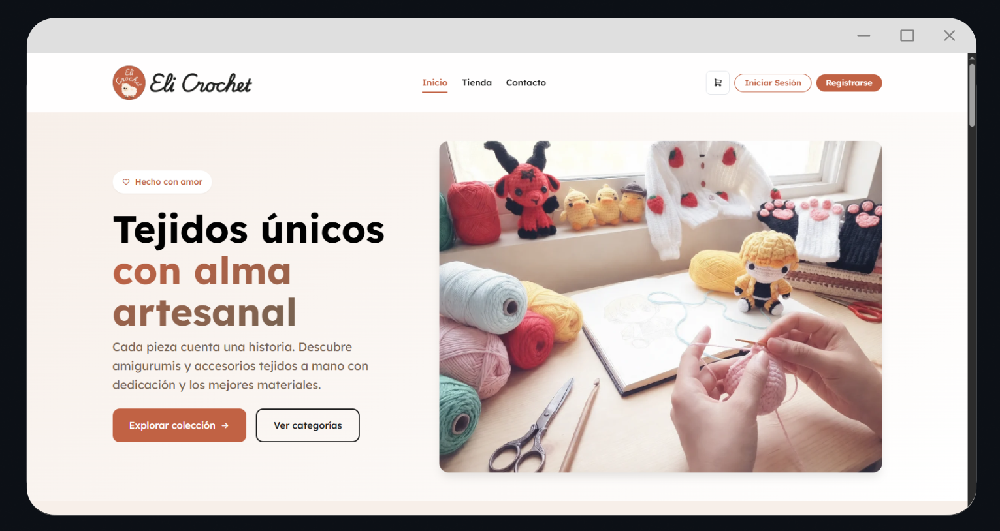
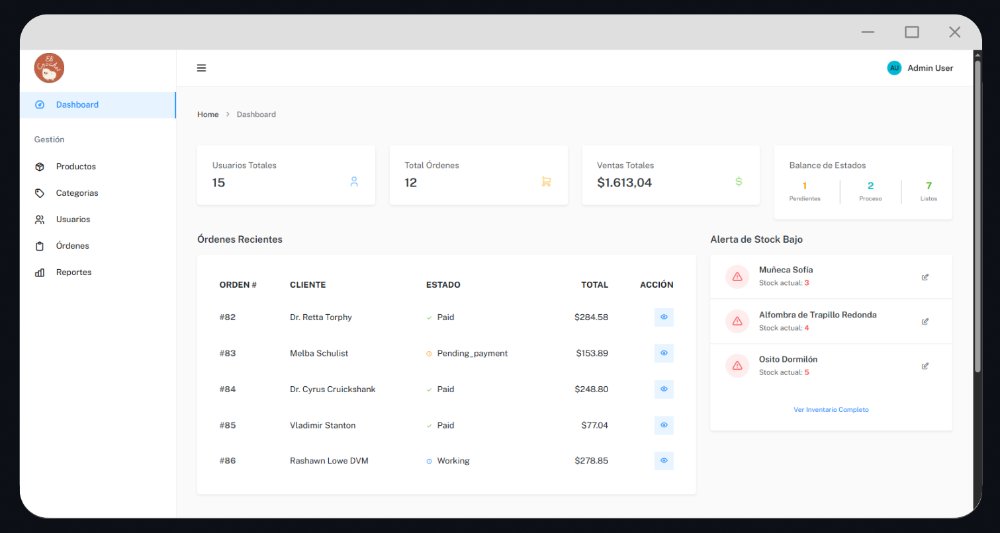

<p align="center">
  
</p>

<h1 align="center">EliCrochet Ecommerce</h1>

<p align="center">
  Tienda en línea para EliCrochet, una microempresa ecuatoriana de artesanías en crochet.<br>
  Catálogo, pagos en línea y pedidos personalizados en un solo lugar, en lugar de chats de WhatsApp.
</p>

<p align="center">
  
  
  
  
  
  
</p>

<p align="center">
  <strong>Demo:</strong> <a href="https://elicrochet-demo.onrender.com">elicrochet-demo.onrender.com</a> · cuentas en <a href="#datos-de-demostración">Datos de demostración</a>
</p>

<p align="center">
  <a href="https://github.com/LeandroRubio-73456/elicrochet-ecommerce/actions/workflows/ci.yml"></a>
  <a href="https://sonarcloud.io/summary/new_code?id=LeandroRubio-73456_elicrochet-ecommerce"></a>
  <a href="https://sonarcloud.io/summary/new_code?id=LeandroRubio-73456_elicrochet-ecommerce"></a>
  <a href="LICENSE"></a>
</p>

---

## Contexto

EliCrochet vendía sus productos artesanales por WhatsApp: el catálogo, el inventario, los pedidos y los pagos se coordinaban a mano, conversación por conversación. Eso hacía difícil saber qué había en stock, seguir cada pedido y atender encargos personalizados.

Esta plataforma digitaliza la tienda completa: catálogo con carrito y pago en línea, un flujo de cotización para pedidos hechos a medida, reseñas de compradores verificados y un panel de administración con reportes financieros.

## Capturas

<p align="center">
  
  
</p>

## Funciones principales

- **Catálogo por categorías**, con especificaciones dinámicas configurables para cada categoría.
- **Carrito y checkout** con la pasarela de pago PayPhone, más un modo simulado para desarrollo.
- **Pedidos personalizados:** el cliente pide una cotización con imágenes de referencia, el administrador la valora y el cliente paga desde su cuenta.
- **Reseñas verificadas:** solo puede reseñar quien compró el producto y tiene la orden completada.
- **Inicio de sesión** con cuenta propia o con Google.
- **Panel de administración:** productos, categorías, usuarios, órdenes y reportes financieros exportables.
- **Correos transaccionales:** confirmación de pago, cambios de estado y cotizaciones.

## Stack tecnológico

- Laravel 12 / PHP 8.4
- MySQL o SQLite (SQLite por defecto en desarrollo local)
- Blade + Bootstrap 5
- PayPhone (pasarela de pago) y Laravel Socialite (Google)
- Pest/PHPUnit, Laravel Pint, GitHub Actions y SonarCloud
- Docker / Laravel Sail para el entorno de desarrollo

## Decisiones técnicas

- **Pasarela de pago simulada automáticamente.** Si no hay credenciales de PayPhone, el sistema muestra una pantalla propia para aprobar o rechazar el pago, y el resto del flujo (orden, stock, correos) se ejecuta igual que con un pago real. Así se puede desarrollar y probar el checkout completo sin una cuenta comercial.
- **Un pago aprobado se procesa de forma atómica.** Cambio de estado, vínculo con el pedido personalizado, descuento de stock y vaciado del carrito ocurren en una sola transacción: si falta stock de algún producto, se revierte todo y la orden no queda a medias. Los productos sin stock pasan a borrador automáticamente.
- **Lógica de negocio en servicios.** Carrito, checkout, pedidos personalizados y PayPhone viven en `app/Services`, y los controladores están separados por área (tienda, cliente y administración). Esto los mantiene delgados y fáciles de probar.
- **Calidad verificada en cada push.** El CI ejecuta Laravel Pint, la suite de pruebas con una cobertura mínima exigida del 60% (la actual ronda el 81%) y el análisis de SonarCloud.
- **Se puede probar sin instalar nada más.** SQLite es el motor por defecto y `composer run setup` deja el proyecto funcionando con datos de demostración en un solo comando.

## Instalación

Requisitos: PHP 8.4, Composer 2, Node.js 20 y npm.

```bash
git clone https://github.com/LeandroRubio-73456/elicrochet-ecommerce.git
cd elicrochet-ecommerce
composer run setup
composer run dev
```

`composer run setup` instala dependencias, crea el `.env`, genera la clave, corre las migraciones con datos de demostración y compila los assets. `composer run dev` levanta el servidor, la cola, los logs y Vite. Abre `http://localhost:8000`.

Instalación con Docker / Laravel Sail, configuración de PayPhone y correo, y solución de problemas: [docs/instalacion.md](docs/instalacion.md).

### Datos de demostración

Estas cuentas también funcionan en la demo en línea. Ahí los datos se reinician en cada arranque y los pagos usan la pasarela simulada.

```text
Administrador: admin@elicrochet.com / password
Cliente:       test@example.com / password
```

## Pruebas

```bash
php artisan test
vendor/bin/pint --test
```

## Estructura del proyecto

```
app/
├── Http/Controllers/
│   ├── Admin/       # Panel de administración y reportes financieros
│   ├── Customer/    # Cuenta del cliente
│   ├── Front/       # Tienda: catálogo, carrito, checkout y reseñas
│   └── Auth/        # Autenticación propia y con Google
├── Models/          # Modelos Eloquent
└── Services/        # CartService, CheckoutService, CustomOrderService, PayPhoneService
docs/
└── instalacion.md   # Docker, PayPhone, correo y solución de problemas
```

## Autor

Desarrollado por **Leandro Rubio**.

[Portafolio](https://leandrorubio-73456.github.io/portafolio/) · [LinkedIn](https://www.linkedin.com/in/leandro-rubio-369651367/) · leandrorubio456@gmail.com

## Licencia

Este proyecto está bajo la licencia [MIT](LICENSE).
